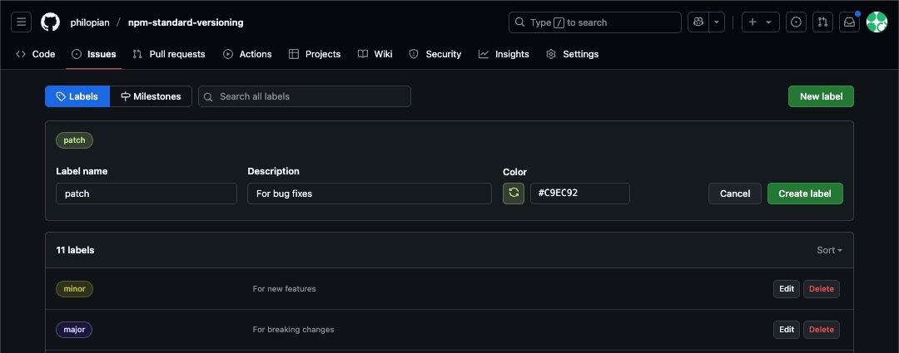

# npm-standard-versioning

A project demonstrating the use of `standard-version` for semantic versioning and changelog generation in Node.js projects.

## Features

- Automated version bumping based on commit messages.
- Changelog generation.
- Git tagging for releases.

## Installation

```bash
npm install
```


## Github Repo
### Issues and Labels

To streamline the release process, create the following labels in your repository's "Issues" tab under "Labels":

- **major**: For breaking changes.
- **minor**: For new features.
- **patch**: For bug fixes (default).




### How It Works

1. When a pull request (PR) is created, add one of the labels (`major`, `minor`, or `patch`) to indicate the type of change.
2. When the PR is merged into the `main` branch, the workflow will:
  - Determine the release type from the PR label.
  - Run `standard-version` with the appropriate release type.
  - Commit the version bump and changelog update.
  - Push the tag and changes back to the `main` branch.
3. The existing `release.yml` workflow will then create a GitHub Release based on this tag.


## Commit Message Guidelines

Follow the [Conventional Commits](https://www.conventionalcommits.org/) specification for commit messages to ensure proper versioning.

## License

This project is licensed under the MIT License.